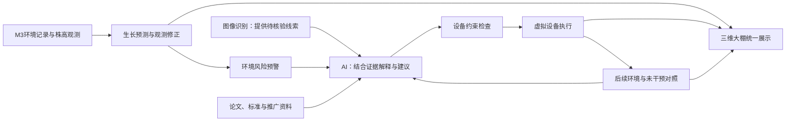

# 项目答辩主线与讲解稿

日期：2026-10-02。以下表述对应当前实现，供计划书、PPT和现场讲解复用。建议名称：**禾序——面向番茄温室的感知、推演与可追溯决策平台**。

## 1. 项目要解决的一个问题

温室管理同时面对叶片症状、环境变化和生长差异。单独的识别结果、监测数字或文字建议，还需要管理者自己判断它们的关系，并观察措施有没有效果。本项目把这些信息放进同一个工作流程：**发现线索、理解状态、提出措施、观察反馈**。

现阶段交付的是基于公开数据的温室管理研究与演示原型。M3提供历史环境和株高观测，模型形成连续状态，AI结合当前状态与可追踪资料提出仿真措施，三维大棚显示设备及环境变化。设备响应尚未经过实棚标定。

### 30秒开场

> 我们关注的是温室里“发现问题以后，怎样形成有依据、能检查效果的处理过程”。平台先用图像识别提供病害线索，再把环境记录和番茄生长模型结合起来；新测量到达后修正模型，环境异常触发预警，AI读取当前大棚和参考资料，提出经过约束检查的设备方案，最后用后续变化检查处理效果。目前采用M3历史数据回放和虚拟设备，展示这一完整流程，为接入真实温室提供可评估的原型。

## 2. 功能之间怎样形成一个整体

| 环节 | 做什么 | 在流程中的意义 | 当前可看到的证据 |
| --- | --- | --- | --- |
| 病害识别 | 图片、视频或摄像头识别可见症状 | 把肉眼线索转为可查询的记录，辅助进一步核验 | 检测类别、置信度、原图及结果记录；不以置信度代替确诊 |
| 数据与文献 | 导入M3，登记本地论文和可引用来源 | 给模型输入、建议与实验提供出处 | 观测日期、来源/补值标记、文献目录与引用片段 |
| 生长模型 | 环境驱动株高预测，历史参数校准，观测到达时修正状态 | 在测量间隙维持连续状态，并接受实际观测检验 | 三条历史对照曲线、逐株误差、在线更新记录 |
| 风险预警 | 累计高温、高湿、VPD等环境暴露 | 让管理者在问题发展前看到需要检查的条件 | 触发值、持续时间、建议和输入可靠性提示 |
| 决策助手 | 普通问答，或关联当前大棚读取状态、检索资料、制定方案 | 把信息转为可讨论、可约束的行动 | 独立/关联会话、实际工具记录、来源与结构化设备目标 |
| 虚拟执行与复核 | 应用设备目标，继续计算，与同事件未干预状态比较 | 检查建议在当前模型中带来什么变化，再调整 | 出力、故障、有效期、温湿变化、风险仍存在等真实状态 |
| 三维界面 | 将同一运行的天气、设备和植株状态显示出来 | 让答辩者能解释数据和措施的联系 | 运行编号、模拟时钟、设备动画和阶段进度 |

库存、采购等原有管理页面可作为平台背景功能。核心展示围绕M3大棚、校准和关联助手；旧规则指挥中心及环境监测使用另一条规则运行，不与M3运行编号等同。当前M3随机事件不会自动形成真实采购或库存扣减，不能把这部分讲成已接通的自动业务。

## 3. 两个必须分别讲清的反馈过程

### 生长模型接受观测检验

1. 用2023、2024年选定同品种CK批次学习株高机制参数。
2. 冻结参数，用2025年作为保留年份评价。首日观测用于初态，后续目标不参与参数拟合。
3. 在线回放时按时间接收环境；没有株高测量就继续预测，有测量到达才进行EKF状态更新。
4. 用“新观测到达前的预测误差”评价下一次预测；当次更新后贴近观测的偏差只能说明拟合程度。

### AI措施接受运行反馈检验

1. 随机天气或设备故障改变场景状态。
2. DeepSeek读取这一运行的环境、设备、风险、知识及上一轮反馈，生成结构化措施。
3. 服务端检查故障设备、强风开窗、CO₂与通风、湿帘与加热等冲突；不合格方案显示拦截。
4. 设备作用经过后续时间步体现，再比较同事件未干预状态；仍有风险就重新判断或保留未解决结果。

**二者的指标不同。**株高预测误差降低不能证明AI控制有效；虚拟温度下降也不能证明模型的产量预测准确。当前AI根据反馈继续判断，模型不会因一次措施有效便自动学会新的设备参数。

## 4. 可以写进计划书的已取得结果

当前已保存版本：`m3-cross-year-2026-10-02T12-01-49.808-a1e148ee`。指标为所选CK植株的逐株配对误差，排除首日初始化点。

| 年份与用途 | 配对点 | 原模拟RMSE / cm | 参数校准模型RMSE / cm | 线性热时间基线RMSE / cm |
| --- | ---: | ---: | ---: | ---: |
| 2023 · 参数学习批次 | 24 | 198.18 | 28.10 | 27.78 |
| 2024 · 参数学习批次 | 48 | 31.73 | 46.53 | 47.79 |
| 2025 · 保留年份评价 | 42 | 111.92 | 22.77 | 24.44 |

2025选定批次相对原模拟RMSE降低约79.7%；复杂机制相对简单线性基线的优势较小，2024批次也出现误差增加。这支持“校准能改善本批次表现，但跨季适用性仍需进一步研究”，不支持“模型普遍达到79.7%准确率”。8个测量日期、6株选定CK植株不等于8个连续日数据，也不等于整个数据集只有这些记录。

在线观测更新的已有完整回放结果与静态参数校准应分别引用，不能把当前未到达的观测计入当前运行。当前界面读取实时运行的实际指标，暂无配对点时显示等待。

知识索引已登记495个块、495个向量、41个来源，包含本地论文及新增摘要。数量说明资料已接入，引用是否匹配问题仍需逐项核对。

已有实际场景记录包括：暴雨处置相对未干预计算降低温度约1.61°C，同时增加湿度约17.67个百分点，风险仍为高；热浪案例出现过不利反馈并保留未解决状态。它们说明系统能够检查和报告措施的利弊，不能宣称每次AI处置都最优或有效。详见[实施记录](2026-10-02-greenhouse-ai-integration-results.md)。

## 5. 五分钟现场路线

| 时间 | 打开的页面与操作 | 主要讲解 |
| --- | --- | --- |
| 0:00–0:30 | 工作台或大棚 | 用30秒开场说明管理问题、现有输入和当前原型范围 |
| 0:30–1:10 | 一条真实识别记录 | 展示症状线索与置信度，说明识别结果需要核验、可带入助手 |
| 1:10–2:10 | 大棚内“校准过程” | 按学习参数、冻结机制、保留年份评价讲解；指出曲线是批次均值、指标是逐株误差，展示2025及2024结果 |
| 2:10–3:40 | 返回大棚，点“一键自动接管” | 左侧看环境，右侧看事件和AI方案，底部看阶段；等待实际AI返回，不把等待动画说成已处理 |
| 3:40–4:20 | 暂停接管，查看最近反馈/完整方案 | 对比同事件未干预温度与湿度，解释处理的取舍；未缓解、拦截或请求失败均按实际结果讲解 |
| 4:20–4:45 | “与决策助手讨论” | 追问刚才方案的原因；切换“普通问答”说明仍保留独立交流，两侧会话互相保留 |
| 4:45–5:00 | 当前大棚或结束页 | 总结已打通信息到行动、行动到反馈的过程，下一阶段是实棚数据和设备参数验证 |

随机事件和LLM用时无法保证固定。可提前运行一轮并暂停，现场点击继续；始终用真实当前结果讲解。短展示用历史校准曲线解释观测修正，不承诺一分钟内一定遇到新的株高测量。当前新测量未到达时，指出模型正在持续预测即可。

## 6. 评委常问的问题

**“只有公开数据，为什么叫数字孪生？”**

现阶段是历史数据驱动的温室数字模型原型，三维、模型与设备共享同一运行状态。实时传感器映射和实棚响应验证尚未完成；计划书中用“数字孪生原型”更准确。后续可以替换输入来源，但还需要传感器对齐、设备能力标定和实际验证。

**“M3是否就是你们采集的实时数据？”**

不是，是公开历史数据按时间回放，模拟持续接入的过程。原始观测保留来源，缺失环境参考补值有标记，虚拟天气和设备响应单独计算。连续曲线来自模型推进，不能把曲线上每天的值称为每天的实测。

**“AI与固定规则有什么区别？”**

预警和设备边界由确定规则负责；AI结合具体状态、设备故障、资料和反馈解释矛盾并提出措施。不同情境可形成不同方案，执行仍由服务端校验。随机事件不保证每次回答相同，不能声称同一随机种子保证LLM输出完全一致。

**“为什么同时需要病害识别和环境预警？”**

图像提供可见症状线索，环境预警提供有利于风险发展的条件；两类证据互补。高湿不等于已发生灰霉病，图像模型也不能确认病原。当前以记录和助手证据联动，识别结果不会自动触发药剂或喷药执行。

**“三维大棚有什么实际意义？”**

它把同一时刻的温湿度、植株模型、天气和设备状态放在一个空间中，便于检查方案与设备是否对应、理解动作后果。展示动画有状态来源，三维美观本身不作为算法准确性的证据。

**“成果的特点是什么？”**

可追踪的数据与资料、接受观测修正的连续模型、受约束的AI措施和可检查的执行反馈，共同组成可讲解的工作流程。属于系统集成与方法应用，不把已有EKF、热时间机制或检索方法写成原创算法。

## 7. 收尾表达与后续计划

> 项目的成果是把识别线索、环境记录、生长预测和AI措施串成可追踪的处理过程：我们可以说明为什么报警、为什么提出这个措施，以及处理后哪些指标改善、哪些风险仍存在。当前公开数据原型已经能够演示和评价这条流程；下一步将接入实棚传感器，标定设备响应，增加叶面湿润与根区水分观测，并在不同季节比较简单规则和AI策略的效果。

近期优先顺序：跨季株高评价与简单基线比较 → 温湿度/设备响应标定 → 室外气象、叶面湿润和根区水量数据 → 受约束的小范围实棚试验。产量、果实饱满度、药剂决策和自动采购不能仅凭现有株高结果宣称已验证。

方法与资料出处见[论文与开源参考审查](2026-10-02-agent-greenhouse-reference-review.md)。计划书引用时保留原论文条件，不把作者实验指标当成本项目指标。
