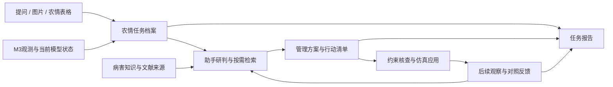

# 赛题五：平台流程贯通与流畅性优化建议

日期：2026-10-08。

状态：供审阅的方案建议，尚未实施。本轮根据用户赛题截图、本地竞赛附件、当前仓库 `999bdef` 的代码和既有流程实操记录梳理；本轮没有重新进行网页测试或性能测量。

本轮补充：根据用户提出“大棚在病斑问答案例中作用不足、希望以大棚演示界面承载完整流程”的意见，重新核对场景计算、已有水肥和病害模块，并再次对照两份竞赛附件。推荐以大棚界面为主展示入口，统一任务档案作为数据基础，逐项补齐决策对应的作用机制和效果解释。

**项目名称保持不变。** 本文的“大棚决策工作台”只描述页面组织方式，不作为新的作品名称。目标用户进一步明确为基层农业从业者及为其提供服务的农技人员。

## 一、题目要求与项目目标

用户截图中的赛题五要求：以大语言模型、知识图谱、检索增强生成等技术构建农业问答与决策服务；接受自然语言或农情数据，生成个性化农事管理方案、病虫害防治建议、水肥调控处方或生产规划报告；重点考察回答专业性、方案可操作性、交互自然流畅与知识检索准确性。

据此，推荐项目主张：

> 面向基层农业从业者，将农情输入、证据研判、方案生成、仿真复核与结果归档衔接为连续的决策服务。以番茄大棚直观解释管理动作的作用、代价和复查条件，提供可观察、可复核的完整示例，并保留多作物的独立农业问答。

对应题目需要交付的内容：

| 题目考察 | 在项目中的落实 | 演示时应给出的证据 |
| --- | --- | --- |
| 自然语言与农情数据输入 | 同一任务接受问题、图片、表格、环境状态 | 原始输入、解析字段与待补信息 |
| 专业回答 | LLM理解问题，读取状态，按需检索，说明适用条件 | 回答依据、数据时间、实际使用来源 |
| 可操作方案 | 明确动作、对象、时机、前提与复查条件 | 有版本的方案与可核对动作清单 |
| 自然流畅交互 | 上下文随任务传递，跨页保留进度，阶段及时可见 | 一个任务连续走完，避免重复录入 |
| 检索准确 | 作物及问题条件约束检索，事实可回到对应原文 | 命中片段、引用对应关系及评价样例 |
| 方案成效 | 仿真动作读取实际执行回执并查看后续变化 | 同事件对照、残留风险与修订记录 |

本地附件1第2页另规定提交演示MP4为3—5分钟、300 MB以内；附件2第2—3页要求需求、技术、实施、成效与附录相互对应。目前161.9秒的流程主片可作素材，最终送审片需要按新贯通流程制作合规时长版本。

### 两份附件对本次优化的具体约束

附件1的评分为创新性25、需求分析15、AI技术应用20、项目实施15、研究结论与应用成效15、总结与展望10。附件2据此组织七部分技术方案。建议按下表准备真实材料，不以新增页面数量作为成果指标。

| 技术方案章节 | 本项目应写清楚 | 需准备的依据 |
| --- | --- | --- |
| 作品概述 | 基层用户难以将识别结果、专业资料与具体管理衔接；番茄大棚承载连续决策流程 | 当前功能、场景范围、可达目标与未完成边界 |
| 需求分析 | 使用者需要知道该做什么、怎样做、效果与代价、何时复查 | 现有流程问题、文献研究；后续真实访谈和可用性观察，未开展的调研不写成已完成 |
| AI技术选择 | 图像识别提供症状候选，LLM理解与组织回答，RAG提供适用依据，模型工具计算和复核 | 实际模型与工具清单、来源追溯、检索和回答评价；知识图谱按实际实现描述 |
| 项目实施 | 同一任务贯通输入、研判、方案、虚拟应用、反馈和报告 | 数据契约、模型版本、动作回执、异常处理、可复现案例 |
| 应用成效 | 分别报告识别、检索、预测修正、环境响应、流程体验的结果 | 各自评价样例、记录和实测指标；模拟资源耗量明确标注，不推算未经验证的真实增产或节本 |
| 总结与展望 | 解释公开数据回放的作用、现有参数假设和接入实棚的步骤 | 已知限制、待采传感器、环境及根区参数标定计划 |
| 附录 | 数据来源、处理方法、缺测处理、代码模型与参考文献 | M3来源与许可说明、本地论文登记、关键算法、运行种子、案例日志 |

提交清单：名称不超过20字，简介不超过300字；技术方案PDF不超过10M；MP4为3—5分钟且300MB以内；答辩PPT提交PDF；佐证合并为一个PDF；代码等大型材料使用按规定命名的百度网盘文件夹和有效链接。保留项目名称，送审前核对名称长度即可。竞赛材料不出现学校名称与指导教师信息。

真实性要求落实到数据与表述：M3按历史记录顺序回放，界面标注“历史观测回放”；天气事件和动作响应标注“仿真”；插值、估计和人工录入分别留标记。补值不冒充实测，也不计入独立观测的误差评价。缺少实际农户应用证明时，用已完成的原型验证与用户观察报告说明成效。

## 二、当前真正影响连贯性的地方

### 2.1 数据与业务衔接

| 当前代码事实 | 对用户造成的影响 | 优先级 |
| --- | --- | --- |
| 首页标题写M3，状态与主要按钮仍读取旧规则 `agentRun` | 首页、大棚与助手可能描述不同运行 | P0 |
| 环境页、资源摘要和部分处方工具仍使用旧规则运行 | 从M3跳过去后，数字和方案依据发生切换 | P0 |
| 图像转助手主要传 `crop/detection/score` | 识别文字能够带入，原图、模型、记录与任务关联较弱 | P0 |
| 农事规划请求只有农情、问题与天数，没有案例/运行/前序方案标识 | 从助手转规划需要再次组织输入 | P0 |
| 规划报告基于独立评测批次，缺当前M3全过程汇总 | 报告无法直接证明这一任务怎样得出、执行和复核方案 | P0 |
| 助手只划分普通/大棚两个会话，切换不同运行沿用同一大棚会话 | 前一个运行的讨论容易成为新运行的历史背景 | P0 |
| 文献页仍写原始数据未导入，M3入口未携带模式 | 已实现能力的入口和文案相互矛盾 | P1 |

### 2.2 运行与交互衔接

- 自动模拟由 `M3LiveWorkbench` 页面定时调用 `step` 推进；组件卸载会暂停。用户去助手或规划时，自动运行缺少独立于页面的时钟。
- M3运行仅保存在后端内存，超过30分钟无活动会释放；前端的 `sessionStorage` 编号不足以支持重启恢复和长期留档。
- 在线工作台、事件面板分别每2秒获取同一运行，助手另有3秒轮询，存在重复请求与版本协调问题。
- 决策助手有步骤SSE，上游正文仍整段返回；农事规划已有文本增量，两者等待体验不一致。
- 自然语言执行意图依赖固定正则。现有场景已经具备版本检查、防重应用和约束机制，但聊天需要明确跟踪本轮异步请求的后续回执。
- 规划的动作勾选目前是前端本地状态，尚未成为可留档的任务完成与复核记录。
- 视频识别默认阈值为空，`parseFloat('')/100` 会产生NaN，需纳入流程稳定性修复。

三维场景已具备实例化绘制、质量档位、自适应降级、后台标签暂停和卸载清理。性能优化应在测量后定位热点，复用已有措施。

## 三、三种整合路径

| 路径 | 工作内容 | 优点 | 代价与限制 |
| --- | --- | --- | --- |
| A：入口与跳转整理 | 调整菜单、按钮、文案与查询参数 | 变更较小、短期展示容易改善 | 底层上下文、报告和运行状态仍分散 |
| **B：以农情任务贯通现有服务，推荐** | 建立统一任务档案、运行上下文、方案产物与事件记录，渐进接入现有模块 | 复用当前模型与服务，解决重复输入和跨模块错位，可形成完整答辩案例 | 需要补上下文接口、持久化与运行调度 |
| C：重建全平台统一引擎 | 合并规则、评测、M3、规划和资源业务 | 架构可深度统一 | 改动面大、回归成本高，近期交付不确定性较高 |

推荐B。实现过程中，将M3作为温室业务默认上下文，旧规则与独立评测保留为明确标注的研究对照入口。

展示组织选择：以大棚决策工作台集中呈现这条任务流程。独立问答、识别记录与研究详情仍保留各自入口；大棚中的快捷操作打开关联面板，保持当前运行和模拟时刻。

## 四、推荐业务流程：围绕一项农情任务

### 4.1 三种入口，共用后续流程

1. **先提问**：用户说“连续阴雨，番茄叶片有斑，下一周怎么管理”。助手提取已知事实，追问关键缺项，形成可编辑任务。
2. **先上传**：图片识别或CSV解析形成任务证据；保留原文件、时间、作物、模型版本和候选结果，进入助手进一步研判。
3. **先预警**：当前大棚出现异常或仿真事件，由事件创建任务，自动带入该时刻环境、设备、风险和模型状态。

在同一任务下，后续页面复用用户已提供的信息。一般知识问答继续作为独立会话；当用户提出制定计划、关联大棚或保存处理过程的需求时，可转成任务。

### 4.2 一份统一档案应该保存什么

- **身份**：任务编号、作物、地点或温室、用户目标、创建时间和处理状态。
- **上下文**：关联M3运行编号、观测游标、场景版本、数据来源与参数版本。
- **输入证据**：原图或表格引用、检测候选、人工描述、观测记录、模型计算与补值标记。
- **研判与依据**：每轮问题、回答、实际引用片段、适用条件及待核验事项。
- **方案产物**：防治建议、农事计划、水肥建议、仿真设备方案及各自版本。
- **过程与反馈**：本轮请求编号、约束核查、应用回执、观察结果、人工确认和修订理由。
- **报告**：按上述已有记录归集的版本化交付文档。

任务编号用于业务归集；运行编号用于模型计算；会话编号用于多轮问答；请求编号用于一次设备方案。四者保留各自含义，通过明确关联衔接。

## 五、各模块在主线中的职责

| 模块 | 调整方向 | 与下一步的衔接 |
| --- | --- | --- |
| 工作台 | 显示当前任务、所选运行、风险和待办，提供“继续处理” | 恢复到任务上次阶段；创建新任务可选提问/上传/预警 |
| 图像、视频识别 | 提供可追踪的观察证据，保留候选与待核验状态 | “交给助手研判”传任务编号和证据编号 |
| 决策助手 | 普通知识问答与任务研判并存；自然回答，行动产物独立展示 | “生成计划”“查看大棚”“查看依据”“归档报告”继承任务上下文 |
| 农事规划 | 沿用研判结论、农情和来源，生成可编辑计划 | 保存行动清单、前提与复查条件；逐项完成留记录 |
| 数字大棚 | 展示这一运行的环境、生长、设备、事件及反馈 | 选中风险可讨论；方案可在同一场景中应用并复核 |
| 模型校准 | 展示同一运行的观测到达与状态更新；历史参数评价置于研究详情 | 从大棚进入后仍显示同一运行编号和模拟时刻 |
| 环境监测 | 使用当前M3统一快照，提供详细曲线与预警说明 | 告警带时间与触发条件进入助手 |
| 文献与知识 | 显示任务实际引用的原文；目录标出来源登记、索引与引用状态 | 查看依据后返回原问题，保留消息和滚动位置 |
| 资源与采购 | 将行动所需资源与可用资源对照，提供缺口草稿 | 人工确认草稿；仿真耗量使用独立账本 |
| 报告 | 汇总本任务输入、方案、出处、回执、反馈和限制 | 导出农事管理报告，保留复核编号 |

旧库存主要含设备物料。水、电、CO₂等模拟消耗维持独立账本；采购缺口仅在有明确单位、物料映射和可用数量时计算。未知用量先列为待核对，药剂建议保留独立专业核查。

### 页面组织建议

保留当前桌面配色和主要路由，一级入口整理为：**工作台、农情与识别、决策与计划、温室运行、知识与文献、资源管理**；账户设置进入独立设置入口。

核心页面顶部共用一条任务栏：任务名称、作物、运行状态、模拟时刻和来源。正文围绕当前工作，侧边展示关联证据和下一步操作。技术版本、计算参数放到可展开详情。

三维大棚以“环境变化—风险出现—AI方案—设备应用—反馈复核”呈现进程；校准保留一个简洁、可解释的入口，详细图表在模型页查看。

### 以大棚界面为主入口的可行性判断

**推荐，适合当前答辩目标。** 项目已经具备场景事件、AI方案、设备目标、约束核查、未干预对照和观测修正，大棚工作台能够集中展示这些既有能力。需要优先补齐共享上下文和嵌入式操作，让界面中的流程确实沿用同一运行。

三种展示组织方式的取舍：

| 方式 | 判断 |
| --- | --- |
| 逐页展示全部模块 | 各模块信息完整，但关联需由讲解者反复说明，容易切换到不同运行 |
| 全屏3D配大量浮窗 | 场景突出，但阅读方案、引用和对照曲线的空间不足，绘制预算和信息负担较高 |
| **大棚决策工作台，推荐** | 用可操作场景、决策面板和过程时间线共同承载一项任务；复杂报告与研究指标按需展开 |

桌面布局建议：

- 顶部：任务、当前运行、模拟时刻、数据来源和运行控制。
- 左侧：农情输入、观察证据、当前风险和待办；可折叠。
- 中部：大棚与设备交互；风险或动作发生时定位相关设备。人工登记的观察位置明确标注，不宣称存在分区气候或逐株诊断模型。
- 右侧：助手对话、当前方案、执行状态与关键依据；采用切换面板，避免同时展开所有信息。
- 底部：事件与观测时间线，以及干预/未干预的温湿度和风险对照；完整校准图按需展开。

普通解释、上传图片、查阅依据、生成计划和导出报告可在此工作台的对应面板完成。无需强制将普通多作物问答绑定到番茄场景。

### 大棚怎样对决策产生实际作用

1. **提供条件**：助手读取该运行的环境、累计暴露、设备健康和已有模型状态，判断建议适用的前提。
2. **承接方案**：环境动作变成具体设备目标、有效期与复核条件，关联同一请求和场景版本。
3. **计算反馈**：方案应用后继续计算环境，与同起点、同事件、同时间步的未干预分支对照。
4. **推动修订**：风险未缓解或出现温湿度权衡时，助手根据本轮反馈修改方案，保留前后版本。
5. **接受观测检验**：新观测到达后修正生长预测，更新后续研判所使用的状态。

当前可用于核心演示的计算：温度、水汽及相对湿度、VPD、CO₂、假设光照、环境暴露预警、设备目标与干预对照。场景参数和光照换算仍包含未标定假设。

当前M3场景没有闭合的根区水肥响应，也没有接入病害进程。项目的旧评测链路已有 `SoilWaterNutrientModel` 与 `PestDiseaseEpidemicModel`，可复用其结构；其中参数、含水率定义和环境适用性仍需校核。旧病害模块使用空气RH代理叶面湿润，未提供防治动作接口，不能直接当作病斑扩展/消退的可靠模型。

环流风机与滴灌在本场景中的状态和动画可显示，但其效果未通过当前环境计算完整建模。当前环境反馈只能说明模拟管理条件怎样变化，不能用来宣称病害治愈、灌溉量最优或产量提高。

### 补齐机制，让基层用户看懂决策效果

**可行，建议从与主案例直接相关的作用链逐项建立。** 每个动作必须能说明：改变什么、通过什么过程、观察哪个量、何时评估、有哪些代价。动作动画读取执行回执，效果呈现读取模型状态和后续观测；不得设置“AI处理后必然恢复正常”的演出逻辑。

建议采用简化温室环境、水量平衡、作物胁迫和病害条件风险的组合。逐株病原传播、全棚流体仿真和精确果实品质预测需要更多输入与验证，不纳入首期。对基层用户先说明管理含义，详细公式和参数放研究详情。

| 决策类别 | 当前基础与需补机制 | 在大棚中呈现的作用和效果 | 复核与边界 |
| --- | --- | --- | --- |
| 通风、加热、遮阳、补光 | 已有环境响应；统一参数、热量/水汽及光照口径，补可靠的资源计量 | 设备动作、示意气流、湿度与温度变化、光照覆盖；同步显示降湿与降温、耗能之间的权衡 | 先复核温湿度、光照及暴露时间；气流为示意，不代表已求解的空间风速场 |
| 滴灌与停灌 | 接入已有根区水量模型；以流量、时长、根区面积/深度和蒸散计算，增加过湿持续暴露 | 滴灌动画、根区剖面含水变化、累计用水、缺水或过湿提示 | 根区初值、基质、流量与含水率定义要有来源；未知时使用明确仿真假设，不写成实际处方 |
| 病害环境管理、病叶处置与复查 | 复用病害条件响应结构；核对识别类别映射，补来源明确的条件暴露/潜伏状态和人工事项记录 | 标记已上传的症状证据，显示环境风险积累或缓解、待复查区域和任务；病斑观察保留原记录 | 预测风险与已识别病害分开；病叶摘除等由人工登记，已有病斑不会因通风瞬间消失 |
| 施肥与水肥调控 | 复用N/P/K、EC结构；补材料成分、剂量、基质和单位核对，校核吸收与淋洗假设 | 根区养分/EC趋势、投加量、用水与积盐风险；按条件给建议 | 输入和参数不完整时先形成补测清单；用量与增产关系未经标定时不输出确定效益 |
| 生长与观测修正 | 保留现有株高观测更新；将可信根区和环境状态接入适用的生长项，保持参数版本 | 快进时显示生长趋势；观测到达时展示预测、观测、更新及后续预测 | 分钟级设备动作与天级生长分开展示；株高更新不能证明水肥、病害或产量模块已验证 |

**接入旧模块前的必做检查：** 土壤状态当前称体积含水率，但默认62、田间持水量75、凋萎点30，需核对是否混用了相对含水率。统一土壤/基质口径和面积、根深、流量、步长；灌溉量与蒸散各计算一次，并由状态更新、耗量台账和报告共用。旧评测中矿化、EC和病害损失含假设，逐项登记来源与适用条件，不能直接移入M3后宣称完成标定。

场景调用的现有 `advanceCalibrated` 将外部养分/病害胁迫固定为1，该函数内株高增量由积温系数推进。新增耦合时需要明确受影响的状态和参数；不能仅把胁迫数值传入页面就声称校准模型已经响应。保留M3株高预测评价作为独立参照，新增机制另行验证。

同一时间步读取相同边界、动作和前一步状态，完成环境、根区、病害条件和作物状态的统一更新，再生成风险与反馈。模块之间共享水量、胁迫及资源通量，避免水量重复消耗；干预和未干预分支从同一快照开始，采用同样事件和假设。M3原始环境是历史温室观测，包含当时未知管理的影响，不能把虚拟动作后的反事实结果当成M3中已观测的处理效果。

基层用户的主要信息只保留四项：**现在有什么问题、建议怎样处理、处理后预计怎样变化、何时复查。** 温度、湿度、根区水分等根据当前问题按需显示；VPD、滤波参数和协方差展开后查看。颜色同时配文字和图标，风险点击可见其输入、触发原因与来源。

动作卡片包含对象、强度或数量、时段、前提、预期改善、潜在代价和复查条件。可由虚拟设备落实的动作显示“已应用于仿真”；巡查、清理和补测进入人工待办。普通问答继续独立使用；只有明确关联该任务时读取大棚。

### 效果展示的时间与数据规则

- 环境动作用分钟或小时观察；病害条件积累和生长趋势按天观察。演示快进显示模拟时刻与倍率，暂停只停止模型时间和相应进程。
- 3D保留一座主大棚；底部以同事件下干预/未干预的少量关键曲线和差值对照，避免同时绘制两座重场景影响流畅性。
- 根区水分可以用剖面示意；病害风险用暴露与复查提示。缺少对应参数时，不生成精确病斑面积、果实饱满度或逐株风速。
- 当前观测、模型估计、执行回执和人工确认各有状态。未经复查的推演显示“预计”；已有观测只更新其对应变量，缺少病害和根区观测时保持未验证标记。
- 观测同化只用于观测所对应的对象和状态；历史M3观测不作为虚拟干预分支的实测结果，不用于证明某项虚拟动作成功。
- 失败、设备故障或措施代价也是反馈。助手读取这些结果继续解释或调整，保留前次方案与理由。

阴雨病斑案例因此可以在同一界面解释：识别给出症状候选 → 模型读取高湿、温度、光照和可用根区条件 → AI给出环境动作与人工检查任务 → 大棚呈现设备和状态变化 → 对照显示改善及代价 → 到达的观测和人工复查驱动后续修订。防治措施是否奏效仍以相应观察验证。

### 方案预演与应用后复核的顺序

首期采用已有能力：AI提出方案 → 约束检查 → 应用仿真 → 观察干预对照 → 继续研判。观察前后比较时同时保留未干预分支，避免把天气自然结束误当成方案效果。

后续可增加2—3个候选方案的短时预演。需要从同一冻结快照克隆独立分支，共用边界假设和时间步，禁止改动主运行；未到达的M3测量不能作为预测输入。指标先采用温湿度偏离和风险暴露，缺少标定的根区、病斑和产量效果不纳入排序。此项列为后续增强，不属于当前已实现能力。

## 六、技术衔接方案

### 6.1 统一读取与持久化

- 增加任务上下文服务，集中返回选定任务的农情、证据、当前运行、方案和事件摘要。
- 前端增加共享任务store；页面通过任务编号恢复上下文。路由和浏览器存储只承担定位与缓存。
- 复用现有识别、对话历史与规划存储；增加任务关联、产物版本和事件记录，保持旧数据可读。
- 当前M3运行提供统一摘要和按游标读取增量事件的接口；全量历史在首次进入或明确请求时读取。
- 记录观测时间、模拟时间与实际接收时间；观测、补值、机理计算、仿真事件与人工描述各有来源标记。
- 普通会话与每个任务的关联会话隔离；切换任务后按对应会话读取历史，每条方案保留生成时使用的快照版本。

### 6.2 自动模拟独立于页面

由后端运行调度器作为唯一推进者，持久化运行/暂停状态、速度及模拟游标。各页面订阅同一运行；页面离开释放画面和订阅，运行按用户选择的状态继续。

手动单步与自动推进共用串行执行机制，保留当前expectedCursor校验。AI分析期间按现有逻辑暂缓模型时钟，及时显示等待原因；得到方案和终态后再继续观察，避免同一事件失去可比状态。

恢复所需状态包括：观测游标、滤波状态及协方差、参数和数据摘要、设备目标及有效期、场景版本、事件和随机生成状态。保存后进行一致性核对。服务重启恢复为暂停；在途AI请求标记中断并由明确的新请求接续，已有应用回执保证动作不会重复。数据或参数版本不一致时保留只读档案，提示创建新的运行。

### 6.3 让助手、计划与执行使用同一份事实

- 助手负责理解意图、补齐关键条件、选择状态/检索/方案工具，并组织自然语言回答。
- 规划服务复用任务事实、实际检索依据和已有方案，保留适合其长文本输出的独立生成流程。
- 病害研判应使用视觉候选、作物与症状进行核对。缺少根区含水量、灌溉面积或肥料参数时，水肥建议给出管理原则与补测项，具体用量待条件齐备再计算。
- 普通解释按问题直接回答；涉及当前设备或风险的判断注明快照时间；涉及关键管理措施时提供适用依据和复查条件。这样保留大模型表达能力，行动事实有可追溯的基础。
- 结构化方案与语言正文分别校验。正文不承担设备执行命令的解析职责。

### 6.4 贯通执行回执

复用现有 `ScenarioSession` 的version、requestId、防重与设备约束。

针对设备方案，明确区分：**生成中、方案已形成、已提交、已应用、观察中、已缓解/仍有风险、被阻断、失败、已过期**。

页面上的“执行仿真”产生明确动作请求；自然语言提出执行需求时，使用结构化意图与用户语义共同确认执行范围。每个请求关联其场景版本和后续回执。AI自由文本里的“已执行”只有在本轮请求回执匹配时才可出现。

自动接管只应用预先允许的虚拟设备范围。未知设备、故障、冲突、过期方案和重复请求均展示实际阻断原因。风险仍存在时继续提出补充观察或修改措施，并保留失败记录。

### 6.5 报告成为完整过程的交付

任务报告直接读取已保存记录，包含：问题与原始农情、研判及证据、管理计划、仿真动作与回执、观察结果、需人工落实的事项、数据边界和引用来源。

历史算法评价和同事件设备反馈分节呈现。报告中的数值引用已保存快照，不在导出时另开不相关的模拟来补结果。已有独立评测报告保留其研究用途。

## 七、流畅性优化

### 7.1 操作连贯

- 同一任务跨页保留输入、会话、方案、当前运行和阶段；返回时恢复位置。
- 每个结果提供与其业务含义对应的下一步操作；状态不可用时说明需要补什么。
- 衔接页面自动预填已有事实并显示来源，用户只核对或补充缺项。
- 对中断、重连、过期运行和失败分析提供接续路径，避免静默清空任务。

### 7.2 请求与AI等待

- 合并同一运行的快照请求，由共享store协调订阅；首期可用单一轮询，稳定后引入服务器事件通知。
- 请求按任务与版本更新，取消过期只读请求，避免旧响应覆盖新上下文。
- 保留步骤SSE，增加正文增量或分段输出。引用与事实校验完成前标注为生成中；未经完整校验的片段不能成为可执行方案或正式报告。
- 模型、检索或网络失败显示对应阶段及可恢复状态；重试回答不重复设备动作。
- 来源元数据和已完成历史使用缓存；当前风险、设备健康和执行回执按运行版本刷新。

### 7.3 三维与图表

- 测量GPU绘制、主线程、Vue状态同步与图表更新耗时；以已有实例化和质量档位为基础调整。
- 3D动画与业务刷新采用不同频率；环境状态变化才更新场景目标，HUD状态限频更新。
- 曲线增量更新和降采样，完整数据保留给导出及模型评价。
- 按设备选择适合的像素比、阴影和天气粒子预算；近景保留关键植株与设备细节，远处采用简化显示。
- 非可见页面暂停绘制与图表动画；服务器运行状态保持可控。

## 八、分批实施顺序

### 第1批：先统一核心任务与温室状态

任务/运行上下文契约、M3统一快照、共享store、大棚决策工作台的任务栏与助手面板、首页和环境页接入、运行会话隔离、集中轮询、后端唯一运行调度与关键状态保存。

验收：同一运行在首页、大棚、环境和助手中编号、模拟时刻与状态一致；离开三维页面后仍按选择继续或暂停；旧规则入口标明用途。

### 第2批：先补齐环境与根区水分的作用链

复用当前环境响应，统一参数与执行回执；校核旧根区模块的含水率、面积、基质、流量、步长与蒸散口径，接入M3场景；用同一水量记录驱动根区状态、滴灌效果和资源台账。增加过湿/缺水暴露、动作代价及复查提示。

验收：每个核心虚拟动作在其应影响的状态中有对应计算；同一起点、事件与参数下可以复现干预对照；失效设备、未知参数和无效果动作有真实状态，不用动画补结果。

### 第3批：贯通输入、研判、计划与报告

大棚中的农情/识别输入与证据面板、CSV/文本归集、助手转计划、统一来源传递、持久行动清单、当轮执行回执、时间线和对照反馈、任务报告。接入来源明确的病害条件风险与人工复查任务；识别类别不能映射的保留候选，N/P/K和EC须待输入与参数就绪再纳入量化展示。

验收：一条真实处理任务走完，不需要重复输入已提供信息；每条方案能追到输入证据和来源；报告与页面事实一致。

### 第4批：完善资源与交互性能

资源缺口草稿、清晰单位和物料映射、默认阈值等已知流程问题、正文输出体验、3D及图表热点优化、刷新与异常接续。

验收：普通问答、任务规划、自动接管互不误带上下文；执行失败可解释，重复点击不会重复应用；性能有前后对照。

### 第5批：形成赛题取证与展示材料

按检查清单实操与测量，更新项目说明、计划书和截图；制作3—5分钟的一案到底演示视频，重点片作补充。

验收：展示中的每次状态转移和结果都有对应记录；计划书、PPT、演示与源码描述一致。

## 九、实施后如何验收

以下为建议的验收目标，当前尚未测量或证明达成。

| 维度 | 验收方法与目标 |
| --- | --- |
| 业务贯通 | 至少8条路径覆盖提问、图片、CSV、预警、转计划、执行反馈、导出和断线接续；可获得数据无需重复填写 |
| 上下文正确 | 同任务页面运行键与来源一致；不同任务/运行不混入历史；旧响应不能覆盖新任务 |
| 动作真实性 | 建议与应用分别记录；已应用状态均有匹配回执；重复重试产生0次重复应用 |
| 数据可靠 | 缺测和估计有标记；新观测到达前的预测误差与更新后偏差分别计算 |
| 机制成立 | 每项动作说明输入、作用过程、响应状态及参数来源；水量和耗量口径一致，病斑观察与条件风险分开；未验证变量不被表述为实测成效 |
| 基层可用 | 用有记录的用户观察核对使用者能否说明主要问题、执行步骤、改善与代价、复查条件；记录任务完成时间、重复录入和理解错误，未开展前不填写通过率 |
| 操作响应 | 普通本地按钮状态反馈目标在200 ms内出现；关键页面缓存恢复目标1秒内；报告等待有明确进度 |
| AI体验 | 记录首阶段、首正文与完整回答的p50/p95；与当前版本在同模型、网络和问题集下对比，优化结果按实测报告 |
| 3D性能 | 固定展示电脑、1920×1080和同一运行条件；以稳定30 fps为初步目标，同时记录低帧与画质变化；对低配置用清晰标识的适配档位 |
| 检索与专业性 | 复用现有评价样例，补跨模块和多轮条件问题；核对top5证据命中、引用支持关系、作物匹配及关键缺项识别 |
| 报告交付 | 随机核对报告关键事实与输入、方案和回执；保留版本与来源，0项凭空生成的执行结果 |

功能实操、性能测量与问答评价在方案批准和用户授权验证后执行，评测结论保留不改善和失败情况。

## 十、答辩的一条完整案例

示例用户诉求：**“连续阴雨，番茄大棚湿度长时间偏高，发现叶片有斑，怎样兼顾环境管理与生长？”**

完整流程围绕同一个大棚工作台展开：

1. **场景与输入**：选择M3运行和合适演示时窗，以显式加速推进观测；触发注明来源的阴雨事件，显示温湿度、光照与累计暴露。用户在工作台输入上述问题并上传病叶示例。
2. **识别与核验**：侧边展示图像检测候选及对应资料；助手区分症状线索与环境风险，说明还需哪些核验。
3. **读取大棚研判**：助手读取当前温度、高湿持续时间、光照、设备健康及已接入的根区状态，围绕当前运行提出管理条件。根区状态标明观测或假设，未知真实条件列为补测项。
4. **形成行动方案**：环境设备动作显示目标、有效期和复查条件；病叶复查等人工事项进入管理计划。来源在原界面查看。
5. **仿真应用**：使用本轮回执更新设备状态与动画，继续计算环境。完成态由回执驱动。
6. **观察与修订**：底部展示同一事件下干预/未干预分支，选择与本方案相关的环境、根区变化和资源代价。若湿度仍高或温度出现不利变化，助手读取该反馈继续调整；保留未成功解决的状态。病害条件缓解与病叶是否变化分别显示。
7. **观测修正**：在选定时窗内真实存在的下一条株高观测到达时，展示更新前预测、观测与更新后的模型状态；该更新用于生长状态检验。
8. **方案交付**：工作台导出同一任务的农事管理报告，包含设备仿真结果、人工待办、引用与后续复查条件。

病叶照片与M3可属于不同来源。将照片用于示范任务时标明关联方式，避免称其来自M3同一植株。预警表示环境条件或累计暴露；株高校准、设备仿真对照与病害识别评价各保留自己的检验对象。

建议4分钟讲解分配：场景与输入25秒、识别与大棚研判45秒、方案与依据40秒、执行与反馈65秒、在线修正35秒、报告与总结30秒。录制时选择已准备好的真实操作案例，保留AI是否成功处理事件的实际结果。

答辩总结建议：

> 我们让农业问题从输入开始形成可持续跟进的任务。识别提供观察线索，知识与模型支持研判，方案落实为有条件的行动，后续观测用于修正预测和复核处理结果，最终形成可追溯的管理报告。番茄温室展示这套决策服务的完整过程；当前观测接入采用公开历史数据回放，设备应用在仿真环境中验证。

## 十一、代码核对位置

以下位置对应当前 `999bdef`：

- 前端 `src/views/homePage/index.vue`：首页M3文案与规则运行入口。
- 前端 `src/stores/agentRun.ts`、`src/views/detailsEnv/index.vue`：旧规则共享状态。
- 前端 `src/views/imgPredict/index.vue:261`：识别跳转参数。
- 前端 `src/views/agentChat/index.vue:239`：会话与运行关联；约469行的读取视觉记录及约581行的聊天请求。
- 前端 `src/views/agentSimulation/index.vue:448`：独立规划请求；约267行的本地动作勾选。
- 前端 `src/views/modelCalibration/M3LiveWorkbench.vue`：运行推进、快照轮询与卸载暂停。
- 前端 `src/views/digitalTwin/components/ScenarioPanel.vue:45`：另一路快照轮询。
- 前端 `src/views/referenceLibrary/index.vue:23`：M3说明与入口。
- 前端 `src/views/videoPredict/index.vue`：默认conf与parseFloat。
- 后端 `agent/m3/M3LiveService.java:24`：内存运行；约97行step与188行释放。
- 后端 `agent/m3/scenario/ScenarioSession.java`：版本检查、请求编号与防重应用。
- 后端 `agent/eco/SoilWaterNutrientModel.java`、`SoilState.java`、`SoilParameters.java`：旧根区水肥结构、单位和假设；`agent/eco/PestDiseaseEpidemicModel.java`、`DiseaseKind.java`：旧病害条件与潜伏进程，当前未接入M3场景。
- 后端 `agent/crop/TomatoCropGrowthModel.java`：旧胁迫入口与M3 calibrated分支；`agent/eval/PerformanceEvaluationService.java`：旧评测耦合调用。
- 后端 `agent/orchestrator/DeepSeekLlmClient.java`：整段正文生成。
- 后端 `agent/tool/PrescriptionDraftTool.java:110`：默认旧规则状态；`ProductionReportTool.java`与`report/ProductionReportService.java`：独立评测报告。
- 后端 `agent/dto/AgriPlanRequest.java`、`agent/plan/PlanDeductionService.java`：当前规划输入与独立生成流程。

待确认的产品选择：项目名称保持不变；采用B路径，以大棚界面集中展示基层农业决策全过程。首批统一任务/温室上下文、助手面板及运行，随后补齐环境与根区水分作用链，贯通研判、人工事项、对照反馈与报告。来源完整且可验证的病害、水肥机制逐项扩展。确认后再形成正式设计与逐项实施计划。
